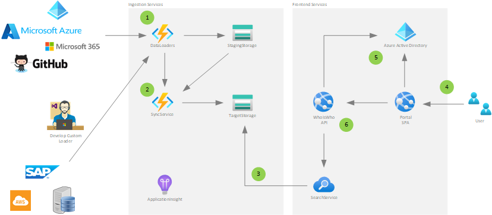
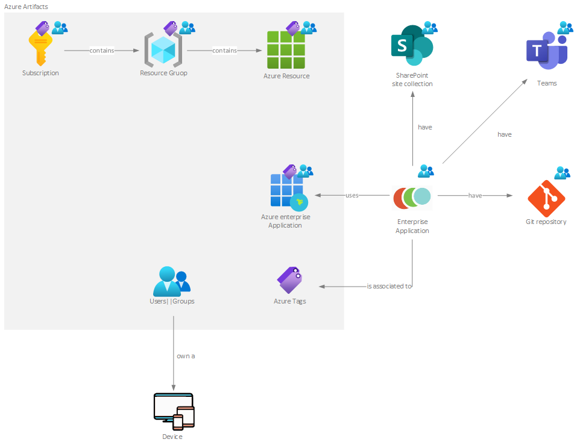

Who Is Who allows you to index all your IT assets, some examples of existent supported objects type are:
* Azure Resources
* Azure Active Directory Users, Groups and Devices
* Microsoft 365 Items: SharePoint Site Collections
* Azure DevOps/ GitHub repositories
* Other: you can extend the solution with custom third party assets type provider

The WhoIsWho app completely relies on the full-text search to find all you need and retrieve the relationships between the different assets.

The solution is completely based on the Azure cloud and is designed in a scalable and extensible way.

The main components are:
* WhoIsWho Web Application: this is a SPA created with Angular that gives to the end-user the perfect UI to explore all the information he/she needs
* Data Provider(s): these are Azure Functions written in C# that integrate with the various asset providers, timed execution allows you to have an always up-to-date situation. The project includes some built-in implementations (Azure Resources, AAD Users, Groups and device, Microsoft 365 SharePoint Sites, GitHub/AzDevOps repos, etc.) but third-party providers can be integrated by implementing new functions that exploit the programming model
* Database: created with Azure Storage Tables represents the storage area for the information retrieved by the various provider
* Search index: created with Azure Cognitive Search, it represents the search index of the assets displayed by the WebApplication. It index the data from the Azure Storage Tables
* Data Synchronizer: this is the component that updates the source of the search index with the informations received from the various providers
* Monitoring: based on Azure Monitor and Application Insights allows to monitor every single component listed above
 
Software development is managed through GitHub and a full DevOps approach as well as infrastructure as Code allow you to deploy the solution on any Azure tenant through existing GitHub actions.

